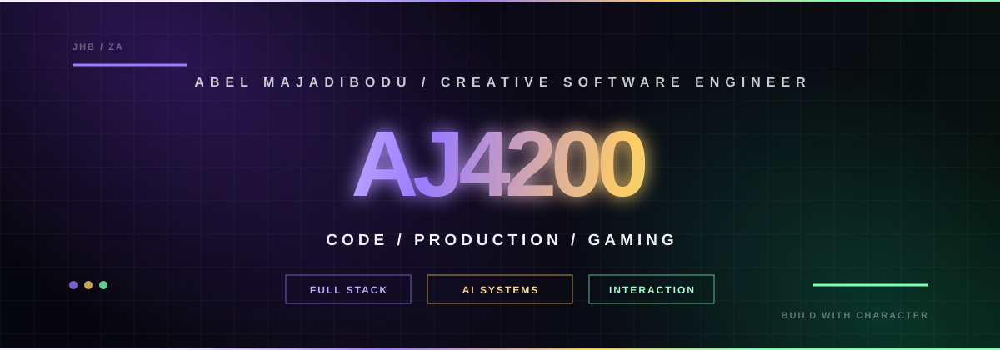

<div align="center">
  <a href="https://aj4200.vercel.app">
    
  </a>
</div>

<div align="center">
  <br />
  <a href="https://aj4200.vercel.app">
    
  </a>
  <a href="https://www.linkedin.com/in/abel-majadibodu-5a0583193">
    
  </a>
  <a href="mailto:abeljackson33@gmail.com">
    
  </a>
</div>

<br />

## Hello, I am Abel.

I am a software engineer from Johannesburg, South Africa, building at the
intersection of **useful systems** and **unusual ideas**.

My work moves between full-stack product engineering, expressive interfaces,
AI-assisted experiences, original music, games, and developer tools. I care
about how software works, but I care just as much about how it feels to use.

> Understand the system. Make it solid. Then give it a point of view.

## Three creative lanes

<table>
  <tr>
    <td width="33%" valign="top">
      <h3>01 / Code</h3>
      <p>
        Full-stack applications, APIs, product prototypes, AI integrations,
        developer tools, and interfaces with a strong visual identity.
      </p>
    </td>
    <td width="33%" valign="top">
      <h3>02 / Production</h3>
      <p>
        Original tracks, sonic experiments, and a space to work without
        requirements: feeling first, structure second.
      </p>
    </td>
    <td width="33%" valign="top">
      <h3>03 / Gaming</h3>
      <p>
        Original games, custom engines, narrative systems, mods, and the
        in-house arcade platform Baturo Arena.
      </p>
    </td>
  </tr>
</table>

## Selected transmissions

| Project | Signal | Built with |
| --- | --- | --- |
| [**AJ4200**](https://aj4200.vercel.app) | This living portfolio: part profile, part creative lab, part product showcase. | Next.js, React, TypeScript, Framer Motion |
| [**DiE-ALOUGE**](https://diealouge.vercel.app) | A Halloween survival experience where conversation, generative narrative, and deception become the game mechanic. | Next.js, OpenAI, Prisma, MongoDB |
| [**Code Shifter**](https://code-shifter.vercel.app) | An AI-assisted tool for translating code between programming languages. | Next.js, OpenAI, Tailwind CSS, CodeMirror |
| [**Baturo Arena**](https://baturo-arena.vercel.app) | An online arcade built around original games and custom engines. | Game systems, custom engines, web platform |

## Inside this repository

This is my GitHub profile repository **and** the source of
[aj4200.vercel.app](https://aj4200.vercel.app).

The experience includes:

- A cinematic welcome route and a full developer-focused home page
- Route-specific color systems, typography, motion, particles, and atmosphere
- An About page split into Code, Production, and Gaming
- An embedded, fullscreen-ready Baturo Arena arcade
- A case-file project carousel, experience timeline, and credential archive
- Service pathways from free discovery demos through custom systems
- A project brief that compiles enquiries directly into Gmail
- Responsive desktop and mobile navigation with oversized route previews
- A custom cursor, themed scrollbar, loaders, ambient stars, leaves, and light
- **NootBot**, an accessible Groq-powered site guide with a local fallback

## System stack

<div>
  
  
  
  
  
  
  
  
</div>

```text
src/
|-- app/          App Router pages, layouts, and server routes
|-- components/   Route experiences and shared interaction systems
|-- data/         Portfolio, biography, experience, and project content
|-- styles/       Global effects plus page-specific visual worlds
`-- datadef/      Shared TypeScript data definitions

public/
|-- fonts/        Custom display and interface typefaces
|-- imgs/         Project art, screenshots, and visual assets
`-- music/        Original productions and cover artwork
```

## Run the signal locally

This project uses `pnpm`.

```bash
git clone https://github.com/AJ4200/AJ4200.git
cd AJ4200
pnpm install
pnpm dev
```

Open [http://localhost:3000](http://localhost:3000).

### Connect NootBot to Groq

NootBot calls Groq through a server-side App Router endpoint, so the API key is
never exposed to the browser.

```bash
cp .env.example .env.local
```

Then add your key:

```env
GROQ_API_KEY=gsk_your_real_key
GROQ_MODEL=llama-3.1-8b-instant
```

See [GROQ_CHATBOT_SETUP.md](./GROQ_CHATBOT_SETUP.md) for the complete setup.
Without a key, NootBot remains useful through its built-in site-guide fallback.

## Commands

| Command | Purpose |
| --- | --- |
| `pnpm dev` | Start the local development server |
| `pnpm build` | Create a production build |
| `pnpm start` | Run the production server |
| `pnpm lint` | Run ESLint |
| `pnpm typecheck` | Check TypeScript without emitting files |

## Accessibility is part of the interface

NootBot includes keyboard operation, focus restoration, screen-reader labels,
live message announcements, quick prompts, readable-font and larger-text modes,
high contrast, reduced motion, and persisted preferences. The navigation also
exposes active-route semantics and opens its visual route previews on keyboard
focus, not only on hover.

## Current signal

I am most useful where product thinking, engineering, and visual craft overlap:
taking a focused feature from idea to implementation, or helping shape an
entire application from its first sketch.

<div align="center">
  <br />
  
  <br /><br />
  <strong>Code with intent. Build with character.</strong>
  <br />
  <sub>Johannesburg, South Africa</sub>
</div>
